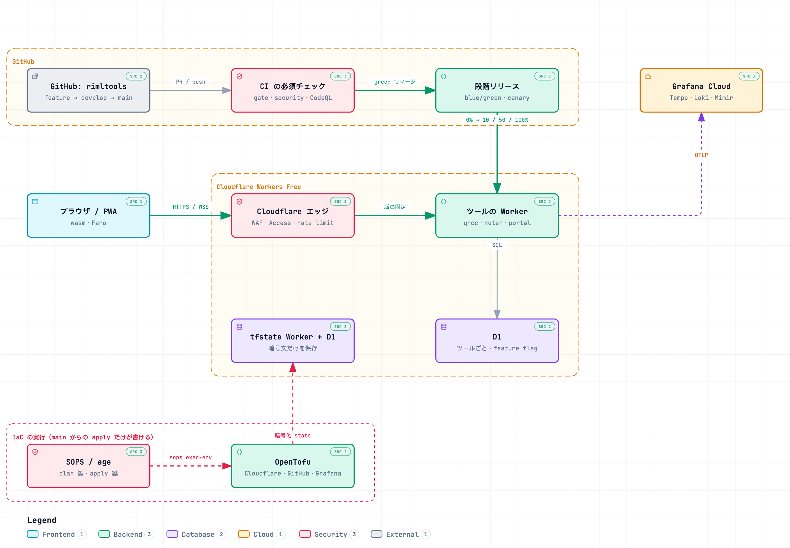
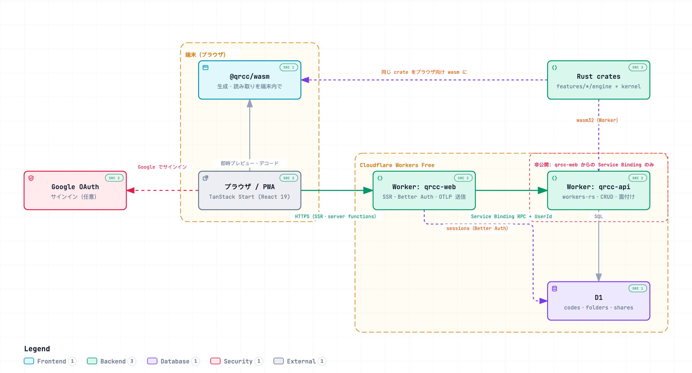
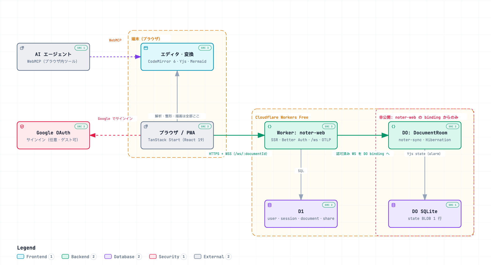
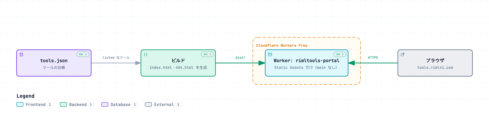

# RimlTools

小さな Web ツール群を 1 つにまとめた monorepo。すべて Cloudflare Workers の **無料枠だけ**で動かす。

| ツール | できること                                               | URL                          | ソース                       |
| ------ | -------------------------------------------------------- | ---------------------------- | ---------------------------- |
| qrcc   | QR・バーコードの生成 / 読み取り / 管理 / ラベル印刷      | <https://qrcc.riml4i.com>    | [`apps/qrcc`](apps/qrcc)     |
| noter  | リアルタイム共同編集のエディタ（Markdown・Mermaid ほか） | <https://noter.riml4i.com>   | [`apps/noter`](apps/noter)   |
| portal | ツールの一覧ページ                                       | `tools.riml4i.com`（公開前） | [`apps/portal`](apps/portal) |

URL は `<tool>.tools.riml4i.com` へ移す予定。移行中は旧 URL もそのまま動き、移行後は新 URL へ 301 で転送する
（手順は [`docs/bootstrap.md`](docs/bootstrap.md) §9）。

## 全体の構成

<picture>
  <source media="(prefers-color-scheme: dark)" srcset="docs/architecture/rimltools-architecture.dark.png">
  
</picture>

クリックで辿れる対話版は [`docs/architecture/rimltools-architecture.html`](docs/architecture/rimltools-architecture.html)（clone してブラウザで開く）。

各ツールの構成図:

| qrcc                                                                                                       | noter                                                                                                | portal                                                                                                                                    |
| ---------------------------------------------------------------------------------------------------------- | ---------------------------------------------------------------------------------------------------- | ----------------------------------------------------------------------------------------------------------------------------------------- |
| [](apps/qrcc/README.md#技術構成) | [](apps/noter/README.md) | [](apps/portal/docs/architecture/portal-architecture.html) |

図は [archify](https://github.com/tt-a1i/archify) で `docs/architecture/*.architecture.json` から作る。
構成を変えたら仕様 JSON を直し、`bun run archify <tool|platform>` で作り直す（生成物は手で編集しない）。

## 設計の要点

- **無料枠で運用しきる。** Workers Free・D1・Grafana Cloud Free・public の GitHub だけを使い、R2 と KV は使わない
  （[qrcc ADR-0009](apps/qrcc/docs/adr/0009-stay-on-workers-free.md)）
- **計算はブラウザで。** QR の生成・読み取りは Rust を wasm にして端末で動かし、Worker を消費しない
  （[qrcc ADR-0003](apps/qrcc/docs/adr/0003-rust-core-dual-target.md)）
- **main へのマージがリリース。** 新しい版を 0% で並べて検証し、10 → 50 → 100% と広げる。版ごとのエラー率が悪化すれば旧版に戻す
  （[ADR-0002](docs/adr/0002-branching-and-release.md)・[ADR-0003](docs/adr/0003-progressive-delivery.md)）
- **デプロイとリリースを分ける。** ダークローンチ・機能ごとのカナリア・A/B テストは feature flag（OpenFeature 互換、D1）で行う
  （[ADR-0004](docs/adr/0004-feature-flags.md)）
- **多層の防御。** rulesets の必須チェック、CodeQL、依存の検査と公開 7 日の待ち期間、action の SHA 固定
  （[ADR-0006](docs/adr/0006-devsecops.md)・[`docs/security.md`](docs/security.md)）
- **インフラはコードで。** OpenTofu で Cloudflare・GitHub・Grafana を管理する。state は手元で暗号化してから自前の backend に置き、
  秘密は SOPS（age）で暗号化してリポジトリに持つ（[ADR-0005](docs/adr/0005-infrastructure-as-code.md)・[ADR-0009](docs/adr/0009-state-and-secrets.md)）
- **観測は Grafana LGTM。** trace・ログ・メトリクスを相互にたどり、SLO・オンコール・外形監視まで Grafana Cloud で見る
  （[ADR-0007](docs/adr/0007-sre.md)・[ADR-0008](docs/adr/0008-observability.md)）
- **見た目は riml-ds。** 自作のデザインシステム [riml-ds](https://github.com/RimlTempest/riml-ds) のトークンと CSS を使い、部品も段階的に寄せる
  （[ADR-0013](docs/adr/0013-riml-ds-adoption.md)。riml-ds への改善提案は [`docs/riml-ds-feedback.md`](docs/riml-ds-feedback.md)）

## ディレクトリ構成

```
apps/<tool>/               ツール本体（qrcc・noter・portal）。詳細は各ツールの README
  services/<worker>/       デプロイ単位の Worker（qrcc: web・api / noter: web・sync）
  features/<name>/         機能ごとの contract・core・ui・server（ADR-0012）
  shared/  e2e/  docs/     ツール内の共有物・Playwright・ツール固有の ADR
packages/                  ツール間で共有するパッケージ（contract・ui・shell・auth・telemetry・flags・sw）
scripts/                   リリース・運用（ops）・CI・構成図のスクリプト（TypeScript）
infra/                     OpenTofu（terraform・grafana）、state の置き場（tfstate）、暗号化した秘密（secrets）
ops/                       ダッシュボードの正本と、ローカルの Grafana LGTM（docker compose）
flags/                     feature flag の定義（ツールごとの JSON）
docs/                      全体の設計・ADR・運用（docs/ops）・runbook
tools.json                 ツールの台帳。CI・リリース・IaC・監視・ポータルがここを読む
```

> 2026-09-22 に `products/` → `apps/`、各ツールの `apps/` → `services/`、`observability/` → `ops/` へ改名した
> （[ADR-0001 の追記](docs/adr/0001-monorepo.md)）。それ以前に作った worktree は作り直し、手元は `bun run clean` する。

## 立ち上げ方

前提は [mise](https://mise.jdx.dev/)。node・bun・rust・OpenTofu などの版はここで固定している。

```bash
mise install && bun install        # lefthook も入る
```

### ローカルで動かす

`.dev.vars` を例から作って値を埋める（コミットしない）。ローカルの D1 に migration を当ててから起動する。

```bash
cp apps/qrcc/services/web/.dev.vars.example apps/qrcc/services/web/.dev.vars
cp apps/noter/.dev.vars.example apps/noter/services/web/.dev.vars

bun run --cwd apps/qrcc/services/web db:local
bun run --cwd apps/noter/services/web db:local

bun run --cwd apps/qrcc/services/api build   # qrcc だけ。Rust の api Worker を 1 回ビルドしておく
bun run dev:qrcc                   # noter は bun run dev:noter。どちらも http://localhost:5173
```

ローカルの Grafana LGTM に trace・ログ・Web Vitals を送って見るとき:

```bash
docker compose -f ops/local/compose.yaml up -d   # docker compose が無ければ docker-compose
bun scripts/ops/local-smoke.ts   # 受け取れているかを確かめる
open http://127.0.0.1:3000
```

`.dev.vars` に書く送り先は [`ops/local/README.md`](ops/local/README.md) にある。

### テスト

```bash
bun run check                      # fmt・lint・型・markuplint・Rust（全ツール）
bun run test                       # 単体・結合テスト
bun run --cwd apps/qrcc a11y   # Playwright + axe（WCAG AAA タグ込み）
bun run --cwd apps/noter e2e
```

### 本番

本番の立ち上げ（鍵の作成・tfstate Worker・初回 apply・最初のリリース）は [`docs/bootstrap.md`](docs/bootstrap.md) の順に進める。

## 困ったとき

| 症状                                      | 対処                                                                                                                                               |
| ----------------------------------------- | -------------------------------------------------------------------------------------------------------------------------------------------------- |
| 依存を上げたのに古い版の型や挙動のまま    | bun の hoisted 配置は、不要になった入れ子の `node_modules`（例: `apps/*/features/*/node_modules`）を消さない。`bun run clean` で全部消して入れ直す |
| `bun install` が公開 7 日未満の版で止まる | 第三者のパッケージは 7 日待つ設定（`bunfig.toml` の `minimumReleaseAge`）。待つか、理由を書いて除外する                                            |
| e2e が別のサーバに当たる・途中で落ちる    | ポートは実行ごとに空きを取る。起動済みのサーバを使うなら `QRCC_E2E_PORT` / `NOTER_E2E_PORT` を指定する                                             |
| qrcc の `dev` が起動しない                | 先に `bun run --cwd apps/qrcc/services/api build`（Rust の api Worker）                                                                            |

## 開発の流れ

- 作業は `develop` から切ったブランチで行い、PR（squash）で `develop` に入れる。`develop` は staging に出る
- `develop` → `main` の Release PR は自動で作られる。**main へのマージが本番リリース**（段階リリース）
- コミットと PR タイトルは Conventional Commits、レビューコメントは Conventional Comments で書く。CI が検査する
  （[`docs/conventions.md`](docs/conventions.md)）
- lefthook が、commit 時に fmt・lint・markuplint・secret 検出を、push 時に型検査とテストを走らせる
- 並行作業は worktree のレーンで行う: `bun run --cwd apps/<tool> wt list`

## ドキュメント

| 文書                                             | 内容                                                        |
| ------------------------------------------------ | ----------------------------------------------------------- |
| [`docs/platform.md`](docs/platform.md)           | 全体設計（環境・リリース・IaC・DevSecOps・SRE）             |
| [`docs/bootstrap.md`](docs/bootstrap.md)         | 本番の立ち上げ手順                                          |
| [`docs/release.md`](docs/release.md)             | 段階リリースと、手動の promote / rollback                   |
| [`docs/flags.md`](docs/flags.md)                 | feature flag の使い方                                       |
| [`docs/security.md`](docs/security.md)           | 多層の防御と脆弱性の報告                                    |
| [`docs/ops/`](docs/ops/README.md)                | 運用（監視・SLO・障害対応）の索引                           |
| [`docs/ops/telemetry.md`](docs/ops/telemetry.md) | 計装（OTLP・Faro）とサンプリング                            |
| [`docs/ops/grafana.md`](docs/ops/grafana.md)     | Grafana の構成・アラート・ローカルでの確認                  |
| [`docs/slo.md`](docs/slo.md)                     | SLO とエラーバジェット                                      |
| [`docs/conventions.md`](docs/conventions.md)     | コミットとレビューの規約                                    |
| [`docs/runbooks/`](docs/runbooks/)               | ロールバック・障害・無料枠・秘密の漏洩・state の復元        |
| [`docs/adr/`](docs/adr/)                         | 横断の設計判断（各ツールの ADR は `apps/<tool>/docs/adr/`） |
